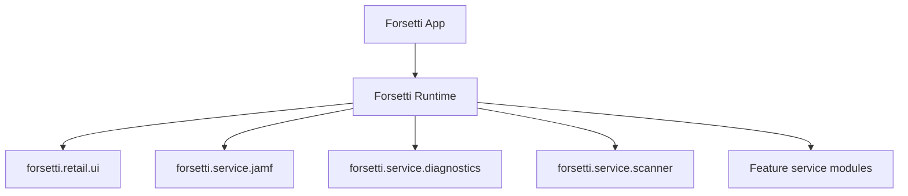

# Forsetti Wiki

## Overview

Forsetti is a modular SwiftUI app for Jamf Pro administration. It provides credential management, API gateway behavior, diagnostics, reporting, inventory search, support technician workflows, prestage workflows, and deployment tracking in one retail application.

## System Shape



## Source Layout

- `ForsettiApp/App`: app entry point, identity, runtime bootstrap.
- `ForsettiApp/DesignSystem`: retail-safe theme, colors, typography, Metal background, and controls.
- `ForsettiApp/Framework`: shared credentials, networking, diagnostics, scanning, and package management.
- `ForsettiApp/Modules`: app-owned feature workflows.
- `ForsettiApp/Resources/ForsettiManifests`: bundled Forsetti module manifests.
- `ForsettiTests`: unit and integration tests.

## Security Model

- Credentials are stored through Keychain-backed services.
- Token refresh and retry behavior remain inside the Jamf service layer.
- Destructive device workflows keep typed confirmation and privilege checks.
- Signing identities and final bundle identifiers must be reviewed by the owner before distribution.

## Diagnostics

Diagnostics use `com.ravenforge.forsetti.diagnostics`, export JSON and Markdown reports, and write local files with the `forsetti-diagnostics` prefix.

## Validation

Run:

```bash
./scripts/verify-no-customer-residue.sh .
xcodebuild -project Forsetti.xcodeproj -scheme Forsetti -destination 'platform=macOS' CODE_SIGNING_ALLOWED=NO clean build
xcodebuild -project Forsetti.xcodeproj -scheme Forsetti -destination 'platform=macOS' CODE_SIGNING_ALLOWED=NO test
```
